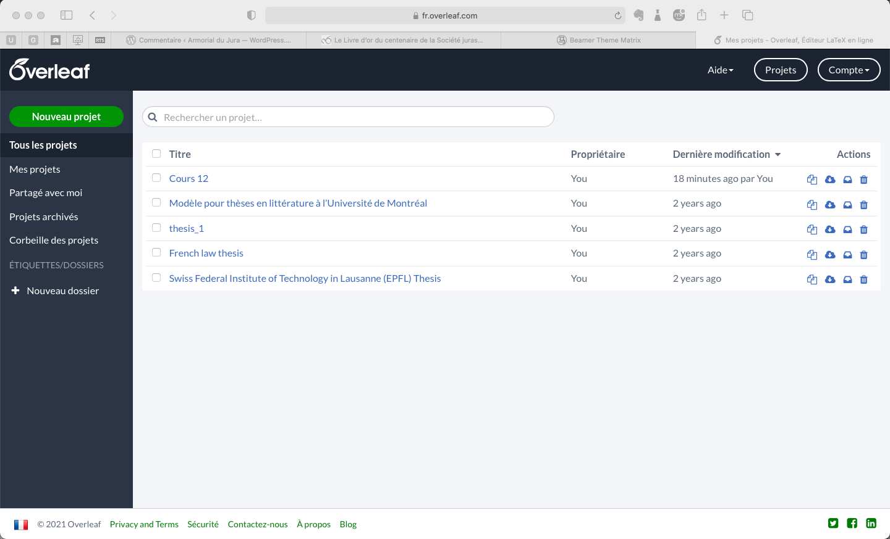
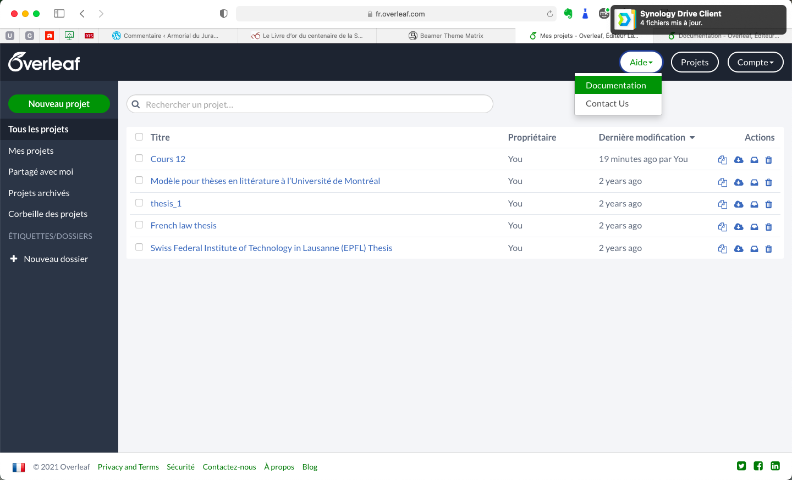
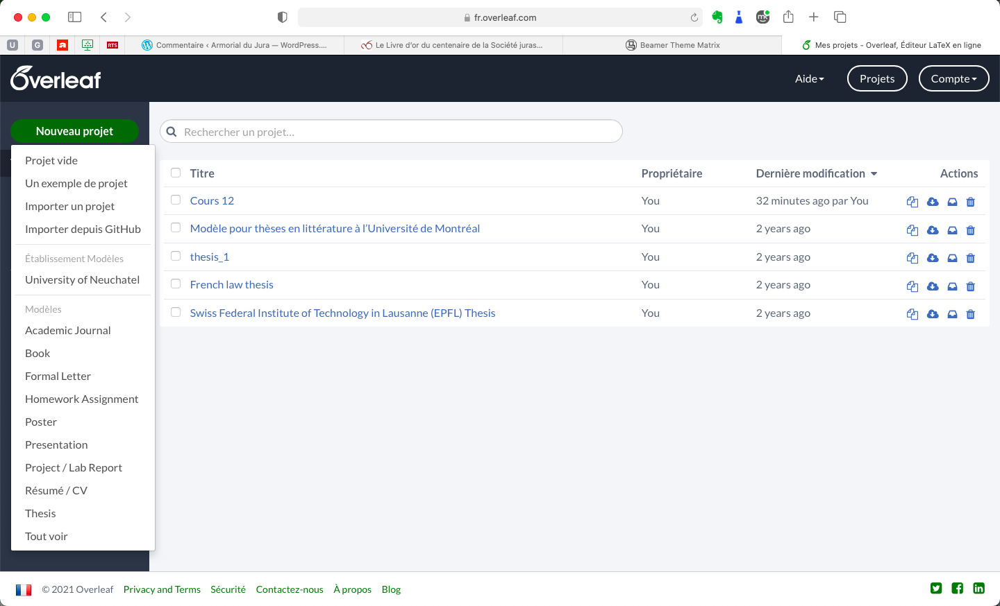
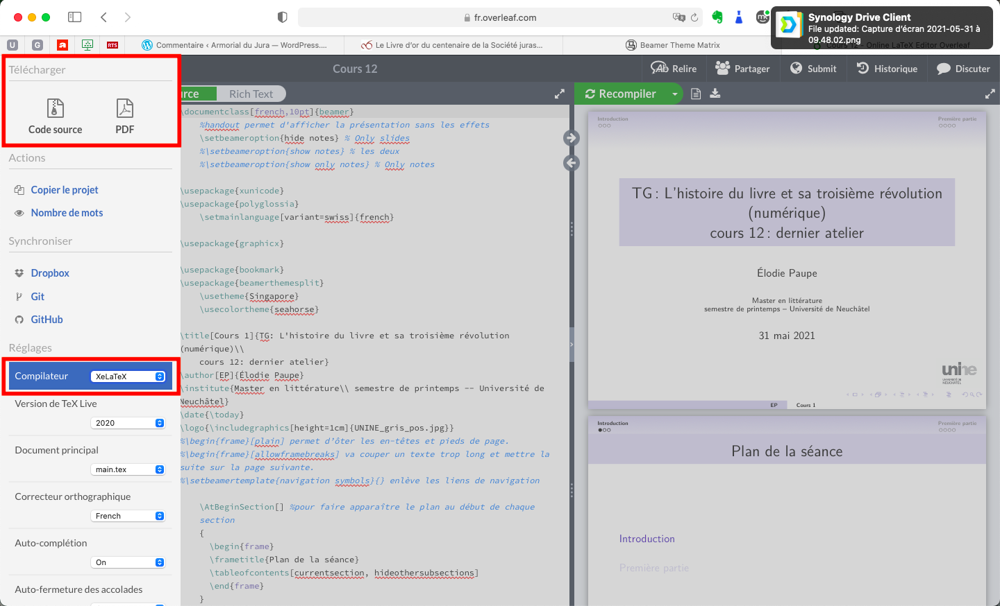

# Présentation succincte d'overleaf

## Demander un compte
Les informations pour activer votre compte institutionnel figure en ligne à [cette adresse](https://mydoc.unine.ch/wiki/Overleaf).

## Débuter sur overleaf

---

Attention: la documentation est en anglais, néanmoins elle est de qualité...

---

Les modèles UniNE ne sont pas encore institutionnalisés, mais vous pouvez vous aider de nombreux autres modèles.

---

1. Dossier ouvert: votre fichier principal .tex (ici main.tex) et les autres fichiers .tex liés ou les illustrations, etc.
1. Zone d'édition: l'onglet au dessus propose "source" (= fichier LaTeX) ou Rich Text: vous êtes obligés de passer par l'encodage latex, mais certains détails de mise en page peuvent être réalisés avec l'interface texte directement. 
1. Bouton permettant la compilation
1. Menu: accès aux réglages (notamment le choix du moteur de compilation); flèche: retour aux projets.
---

1. Pour compiler les documents que nous avons réalisés en classe, vous devez régler le compilateur sur xelatex. 
1. Vous n'avez donc pas besoin de la commande magic `%!TEX program=xelatex`
1. Pour télécharger les documents en .tex ou .pdf, c'est également sous menu qu'il faut se rendre.
